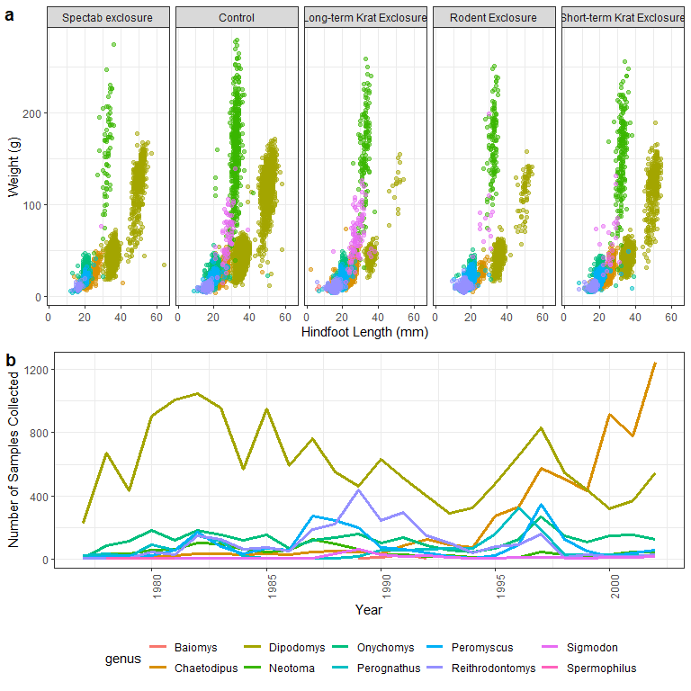
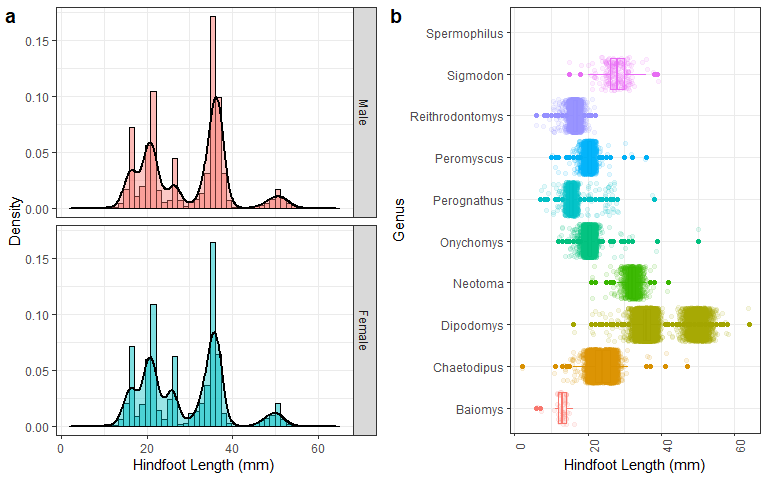
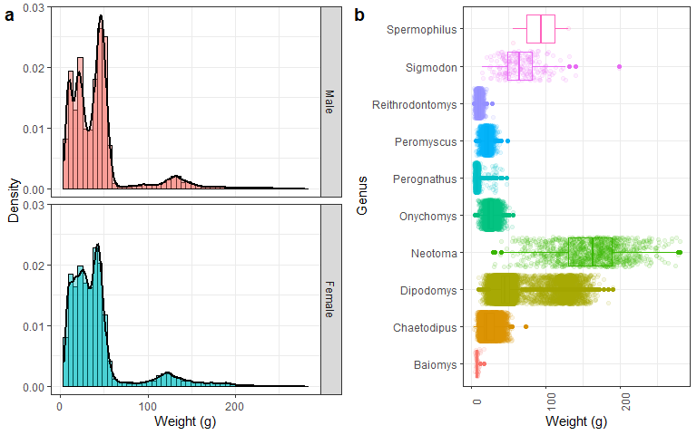

<div style="margin-bottom:50px;">

<style>
 #TOC {
  background: url("./images/Centre-for-Precision-Health.png");
  background-size: contain;
  padding-top: 100px !important;
  background-repeat: no-repeat;
}
</style>

</div>

<style>
  p.caption {
    font-size: 1.2em;
    }
  caption {
    font-size: 1.2em;
    } 
  body{
    font-size: 12pt;
    }
</style>


<script src="hideOutput.js"></script>   


## Overview

<br> 

This is a walk-through of the first activity for the semester. I purposely gave you little direction to get you started on decision making required in bioinformatics. You may have chosen different examples, which is fine as you will also be doing different projects. Hopefully this will explain a few things that were confusing. 

Make sure you have a go doing this yourself and submit your final output to "*Discussion Board > Week 1 Output*". Also, check each others content. Your peers may know how to do something more efficiently. 

<br> 

***

## Load Dependencies


```r
library(tidyverse)
library(readxl)
library(kableExtra)
library(ggpubr)
```

## Data Preparation


```r
# first list the sheet names for your info
excel_sheets("./data/surveys_data.xlsx")
```

```
## [1] "surveys"      "plot_info"    "species_info"
```

```r
# load the data first
survey_data <- read_excel("./data/surveys_data.xlsx", sheet = 1)

# load in plot info
plot_info <- read_excel("./data/surveys_data.xlsx", sheet = 2)

# load in species info
species_info <- read_excel("./data/surveys_data.xlsx", sheet = 3)
```

<br>

It is good practice to always check your data structure first and make sure your variables are in the right format. Then you should clean variables and add value labels. Bioinformatics and statistics is about 80% data preparation and 20% analysis and visualisation. 

<br>

<div class="fold o">


```r
# check structure of the data - this function shows variable names (next to `$`), 
# variable format, and the first few lines of code. 
str(survey_data)
```

```
## tibble [35,549 x 10] (S3: tbl_df/tbl/data.frame)
##  $ record_id      : num [1:35549] 1 2 3 4 5 6 7 8 9 10 ...
##  $ month          : num [1:35549] 7 7 7 7 7 7 7 7 7 7 ...
##  $ day            : num [1:35549] 16 16 16 16 16 16 16 16 16 16 ...
##  $ year           : num [1:35549] 1977 1977 1977 1977 1977 ...
##  $ plot_id        : num [1:35549] 2 3 2 7 3 1 2 1 1 6 ...
##  $ species_id     : chr [1:35549] "NL" "NL" "DM" "DM" ...
##  $ sex            : chr [1:35549] "M" "M" "F" "M" ...
##  $ hindfoot_length: num [1:35549] 32 33 37 36 35 14 NA 37 34 20 ...
##  $ weight         : num [1:35549] NA NA NA NA NA NA NA NA NA NA ...
##  $ date           : POSIXct[1:35549], format: "1977-07-16" "1977-07-16" ...
```

```r
# ok so first off I am going to recode sex as numeric.
# to recode sex and set value labels, you can use something like below 
# (though other options exist).
survey_data$sex <- ifelse(survey_data$sex=="M", 0, 
                          ifelse(survey_data$sex=="F", 1, NA))
survey_data$sex <- factor(survey_data$sex,
                          levels=c(0,1),
                          labels=c("Male", "Female"))
```

</div>

<br>

Label plot_id in main dataset using the variables in your `plot_info` data. 

<br>


```r
# explore the data structure to determine steps required
str(plot_info)  
```

```
## tibble [24 x 2] (S3: tbl_df/tbl/data.frame)
##  $ plot_id  : num [1:24] 1 2 3 4 5 6 7 8 9 10 ...
##  $ plot_type: chr [1:24] "Spectab exclosure" "Control" "Long-term Krat Exclosure" "Control" ...
```

```r
head(plot_info)  #prints first few lines of data so you can see what the format is
```

```
## # A tibble: 6 x 2
##   plot_id plot_type                
##     <dbl> <chr>                    
## 1       1 Spectab exclosure        
## 2       2 Control                  
## 3       3 Long-term Krat Exclosure 
## 4       4 Control                  
## 5       5 Rodent Exclosure         
## 6       6 Short-term Krat Exclosure
```

```r
# label plot_id according to the plot_type info in thhe plot_info dataset
survey_data$plot_id <- factor(survey_data$plot_id,          # this is the variable we want label
                              levels=plot_info$plot_id,     # these are the levels of the factors
                              labels=plot_info$plot_type)   # these are the value labels matching those levels
```

<br>

Label `species_id` in main dataset using the variables in your `species_info` data.

<br>

<div class="fold o">


```r
# explore the data structure to determine steps required
str(species_info)
```

```
## tibble [54 x 4] (S3: tbl_df/tbl/data.frame)
##  $ species_id: chr [1:54] "AB" "AH" "AS" "BA" ...
##  $ genus     : chr [1:54] "Amphispiza" "Ammospermophilus" "Ammodramus" "Baiomys" ...
##  $ species   : chr [1:54] "bilineata" "harrisi" "savannarum" "taylori" ...
##  $ taxa      : chr [1:54] "Bird" "Rodent" "Bird" "Rodent" ...
```

```r
# next merge `genus` and `species` variables into one column.
# NOTE: this last bit adds a space between genus and species
species_info$species_lab <- paste(species_info$genus, species_info$species, " ") 

# check the first 10 rows using this code
species_info[1:10,]  # head(species_info) will give you the first 6 rows
```

```
## # A tibble: 10 x 5
##    species_id genus          species        taxa   species_lab                  
##    <chr>      <chr>          <chr>          <chr>  <chr>                        
##  1 AB         Amphispiza     bilineata      Bird   "Amphispiza bilineata  "     
##  2 AH         Ammospermophi~ harrisi        Rodent "Ammospermophilus harrisi  " 
##  3 AS         Ammodramus     savannarum     Bird   "Ammodramus savannarum  "    
##  4 BA         Baiomys        taylori        Rodent "Baiomys taylori  "          
##  5 CB         Campylorhynch~ brunneicapill~ Bird   "Campylorhynchus brunneicapi~
##  6 CM         Calamospiza    melanocorys    Bird   "Calamospiza melanocorys  "  
##  7 CQ         Callipepla     squamata       Bird   "Callipepla squamata  "      
##  8 CS         Crotalus       scutalatus     Repti~ "Crotalus scutalatus  "      
##  9 CT         Cnemidophorus  tigris         Repti~ "Cnemidophorus tigris  "     
## 10 CU         Cnemidophorus  uniparens      Repti~ "Cnemidophorus uniparens  "
```

```r
# there is lagging space present, which I want to remove
species_info$species_lab <- trimws(species_info$species_lab, which = "right")
species_info[1:10,]
```

```
## # A tibble: 10 x 5
##    species_id genus           species        taxa   species_lab                 
##    <chr>      <chr>           <chr>          <chr>  <chr>                       
##  1 AB         Amphispiza      bilineata      Bird   Amphispiza bilineata        
##  2 AH         Ammospermophil~ harrisi        Rodent Ammospermophilus harrisi    
##  3 AS         Ammodramus      savannarum     Bird   Ammodramus savannarum       
##  4 BA         Baiomys         taylori        Rodent Baiomys taylori             
##  5 CB         Campylorhynchus brunneicapill~ Bird   Campylorhynchus brunneicapi~
##  6 CM         Calamospiza     melanocorys    Bird   Calamospiza melanocorys     
##  7 CQ         Callipepla      squamata       Bird   Callipepla squamata         
##  8 CS         Crotalus        scutalatus     Repti~ Crotalus scutalatus         
##  9 CT         Cnemidophorus   tigris         Repti~ Cnemidophorus tigris        
## 10 CU         Cnemidophorus   uniparens      Repti~ Cnemidophorus uniparens
```

```r
# label the species id values in survey_data -- same as above
survey_data$species_id <- factor(survey_data$species_id, 
                                 levels=species_info$species_id,
                                 labels=species_info$species_lab)

# add genus and taxa to your data too
survey_data <- merge(survey_data, species_info[,c(2,4,5)], 
                     by.x="species_id", by.y="species_lab")

str(survey_data)
```

```
## 'data.frame':	34786 obs. of  12 variables:
##  $ species_id     : Factor w/ 54 levels "Amphispiza bilineata",..: 3 3 2 2 2 2 2 2 2 2 ...
##  $ record_id      : num  18932 20588 27074 12824 22059 ...
##  $ month          : num  8 1 10 5 2 4 5 10 10 12 ...
##  $ day            : num  7 24 26 28 4 21 15 24 25 14 ...
##  $ year           : num  1991 1993 1997 1987 1995 ...
##  $ plot_id        : Factor w/ 5 levels "Spectab exclosure",..: 3 2 2 5 2 1 4 3 5 4 ...
##  $ sex            : Factor w/ 2 levels "Male","Female": NA NA NA NA NA NA NA NA NA NA ...
##  $ hindfoot_length: num  NA NA NA NA NA NA NA NA NA NA ...
##  $ weight         : num  NA NA NA NA NA NA NA NA NA NA ...
##  $ date           : POSIXct, format: "1991-08-07" "1993-01-24" ...
##  $ genus          : chr  "Ammodramus" "Ammodramus" "Ammospermophilus" "Ammospermophilus" ...
##  $ taxa           : chr  "Bird" "Bird" "Rodent" "Rodent" ...
```

```r
head(survey_data)
```

```
##                 species_id record_id month day year                   plot_id
## 1    Ammodramus savannarum     18932     8   7 1991  Long-term Krat Exclosure
## 2    Ammodramus savannarum     20588     1  24 1993                   Control
## 3 Ammospermophilus harrisi     27074    10  26 1997                   Control
## 4 Ammospermophilus harrisi     12824     5  28 1987 Short-term Krat Exclosure
## 5 Ammospermophilus harrisi     22059     2   4 1995                   Control
## 6 Ammospermophilus harrisi     18618     4  21 1991         Spectab exclosure
##    sex hindfoot_length weight       date            genus   taxa
## 1 <NA>              NA     NA 1991-08-07       Ammodramus   Bird
## 2 <NA>              NA     NA 1993-01-24       Ammodramus   Bird
## 3 <NA>              NA     NA 1997-10-26 Ammospermophilus Rodent
## 4 <NA>              NA     NA 1987-05-28 Ammospermophilus Rodent
## 5 <NA>              NA     NA 1995-02-04 Ammospermophilus Rodent
## 6 <NA>              NA     NA 1991-04-21 Ammospermophilus Rodent
```

```r
# remove labels with missing
survey_data$species_id <- droplevels(survey_data$species_id)
```

</div>

<br>

We noticed some weirdness in the data on campus. This is common and the dataset was not clean. For the purpose of this exercise, let's remove any with missing `sex` or `weight`.

<br>


```r
# new dataset without missing data for sex or weight
survey_data$sexmiss <- ifelse(is.na(survey_data$sex), 1, 0)  # creating index number to indicate missing sex
survey_data$weightmiss <- ifelse(is.na(survey_data$weight), 1, 0)
survey_data$anymiss <- ifelse(survey_data$sexmiss==1 | survey_data$weightmiss==1, 1, 0)  # missing either

table(survey_data$sexmiss, survey_data$anymiss)    # check all sexmiss are counted
```

```
##    
##         0     1
##   0 32182   856
##   1     0  1748
```

```r
table(survey_data$weightmiss, survey_data$anymiss) # ditto for weightmiss
```

```
##    
##         0     1
##   0 32182   101
##   1     0  2503
```

```r
table(survey_data$anymiss)  #2604 to be excluded
```

```
## 
##     0     1 
## 32182  2604
```

```r
survey_data2 <- survey_data[!survey_data$anymiss==1, ]    # new data excluding missing by indicator
dim(survey_data)  # 34786    15  (read as row x column)
```

```
## [1] 34786    15
```

```r
dim(survey_data2) # 32182    15  (34786 - 2604 = 32182... confirm exclusion worked)
```

```
## [1] 32182    15
```

<div class="fold o">


```r
str(survey_data2)
```

```
## 'data.frame':	32182 obs. of  15 variables:
##  $ species_id     : Factor w/ 48 levels "Amphispiza bilineata",..: 4 4 4 4 4 4 4 4 4 4 ...
##  $ record_id      : num  17486 19121 19249 17374 18252 ...
##  $ month          : num  4 10 11 4 1 3 12 11 3 5 ...
##  $ day            : num  26 10 13 24 12 7 15 14 14 25 ...
##  $ year           : num  1990 1991 1991 1990 1991 ...
##  $ plot_id        : Factor w/ 5 levels "Spectab exclosure",..: 3 2 3 1 3 3 3 3 3 3 ...
##  $ sex            : Factor w/ 2 levels "Male","Female": 1 1 1 1 2 2 2 2 2 2 ...
##  $ hindfoot_length: num  14 13 12 14 14 14 14 16 14 14 ...
##  $ weight         : num  7 6 8 7 9 9 8 9 8 10 ...
##  $ date           : POSIXct, format: "1990-04-26" "1991-10-10" ...
##  $ genus          : chr  "Baiomys" "Baiomys" "Baiomys" "Baiomys" ...
##  $ taxa           : chr  "Rodent" "Rodent" "Rodent" "Rodent" ...
##  $ sexmiss        : num  0 0 0 0 0 0 0 0 0 0 ...
##  $ weightmiss     : num  0 0 0 0 0 0 0 0 0 0 ...
##  $ anymiss        : num  0 0 0 0 0 0 0 0 0 0 ...
```

```r
head(survey_data2)
```

```
##          species_id record_id month day year                  plot_id    sex
## 743 Baiomys taylori     17486     4  26 1990 Long-term Krat Exclosure   Male
## 744 Baiomys taylori     19121    10  10 1991                  Control   Male
## 745 Baiomys taylori     19249    11  13 1991 Long-term Krat Exclosure   Male
## 746 Baiomys taylori     17374     4  24 1990        Spectab exclosure   Male
## 747 Baiomys taylori     18252     1  12 1991 Long-term Krat Exclosure Female
## 748 Baiomys taylori     19775     3   7 1992 Long-term Krat Exclosure Female
##     hindfoot_length weight       date   genus   taxa sexmiss weightmiss anymiss
## 743              14      7 1990-04-26 Baiomys Rodent       0          0       0
## 744              13      6 1991-10-10 Baiomys Rodent       0          0       0
## 745              12      8 1991-11-13 Baiomys Rodent       0          0       0
## 746              14      7 1990-04-24 Baiomys Rodent       0          0       0
## 747              14      9 1991-01-12 Baiomys Rodent       0          0       0
## 748              14      9 1992-03-07 Baiomys Rodent       0          0       0
```

```r
names(survey_data2)  #prints name and column number -- use to exclude unwanted cols
```

```
##  [1] "species_id"      "record_id"       "month"           "day"            
##  [5] "year"            "plot_id"         "sex"             "hindfoot_length"
##  [9] "weight"          "date"            "genus"           "taxa"           
## [13] "sexmiss"         "weightmiss"      "anymiss"
```

```r
survey_data2 <- survey_data2[, c(1:12)] 
```

</div>

<br>

Last thing I'll do is create a season variable from the date. Season can affect many things in the animal kingdom as well as in bioinformatics studies. 

<br>

>What are some examples you can think of??

<br>


```r
# create season variable with a nested ifelse function -- this is intermediate level but USEFUL to know
survey_data2$season <- ifelse(survey_data2$month==12 | survey_data2$month==1 | survey_data2$month==2, 0,  #if Dec to Feb, code '0', else.. 
                              ifelse(survey_data2$month==3 | survey_data2$month==4 | survey_data2$month==5, 1, 
                                     ifelse(survey_data2$month==6 | survey_data2$month==7 | survey_data2$month==8, 2, 
                                            ifelse(survey_data2$month==9 | survey_data2$month==10 | survey_data2$month==11, 3, NA)))) 
# check
table(survey_data2$season)
```

```
## 
##    0    1    2    3 
## 7401 8947 7779 8055
```

```r
# label seasons variable
survey_data2$season <- factor(survey_data2$season,
                              levels=c(0,1,2,3), #telling it these are the levels
                              labels=c("Summer", "Autumn", "Winter", "Spring"))
table(survey_data2$season) # labels have worked
```

```
## 
## Summer Autumn Winter Spring 
##   7401   8947   7779   8055
```

<br>

***

## Exploratory Data Analysis (EDA)

<br>

<div class="fold s">


```r
# counts
summSeason <- survey_data2 %>%
  group_by(season) %>%
  count() %>%  #count by season
  as.data.frame() #output as data.frame not tibble
summSeason$p <- round(summSeason$n/nrow(survey_data2)*100,1)  #create percentages

summSex <- survey_data2 %>%
  select(season, sex) %>%
  group_by(season) %>%
  count(sex) %>%
  as.data.frame()
summSex$p <- c(round(summSex$n[1:2]/sum(summSex$n[1:2])*100,1),
               round(summSex$n[3:4]/sum(summSex$n[3:4])*100,1),
               round(summSex$n[5:6]/sum(summSex$n[5:6])*100,1),
               round(summSex$n[7:8]/sum(summSex$n[7:8])*100,1))  #create percentages by columns

# means
summMeans <- survey_data2 %>%
  select(season, hindfoot_length, weight) %>%
  group_by(season) %>%
  summarise(across(.cols = everything(), ~mean(., na.rm = TRUE))) %>%
  as.data.frame()

# sd
summSD <- survey_data2 %>%
  select(season, hindfoot_length, weight) %>%
  group_by(season) %>%
  summarise(across(.cols = everything(), ~sd(., na.rm = TRUE))) %>%
  as.data.frame()

# plot by season - do they differ over the year??
summPlots <- survey_data2 %>%
  select(season, plot_id) %>%
  group_by(season) %>%
  count(plot_id) %>%
  as.data.frame()
summPlots$p <- c(round(summPlots$n[1:5]/sum(summPlots$n[1:5])*100,1),
                 round(summPlots$n[6:10]/sum(summPlots$n[6:10])*100,1),
                 round(summPlots$n[11:15]/sum(summPlots$n[11:15])*100,1),
                 round(summPlots$n[16:20]/sum(summPlots$n[16:20])*100,1))
```

<br>

To create summary table using `kableExtra` and my output from `dplyr`, first I create a data frame that prints exactly how I would want it to look (i.e. vars in first column then subsequent columns are some condition).

<br>


```r
t1 <- data.frame(vars =   c(paste0("**Overall Count** "," *n (%)*"), 
                            paste0("**Sex** "," *n (%)*"), 
                                   "*Female*", "*Male*", 
                            paste0("**Hindfoot Length** ", "mm", " *mean (SD)*"),
                            paste0("**Weight** ", "g", " *mean (SD)*"),
                            paste0("**Plot Information** ", "*n (%)*"),
                                  "*Spectab Exclusure*", "*Control*", "*Long-term Krat Exclosure*", 
                                  "*Rodent Exclosure*", "*Short-term Krat Exclusure*"),
                 
                 summer = c(paste0(summSeason$n[1], " (", summSeason$p[1], "%)"),
                            "",  # add space for sex title
                            paste0(summSex$n[1:2], " (", summSex$p[1:2], "%)"),
                            paste0(round(summMeans$hindfoot_length[1],2), " (", 
                                   round(summSD$hindfoot_length[1], 2), ")"),
                            paste0(round(summMeans$weight[1], 2), " (", 
                                   round(summSD$weight[1], 2), ")"),
                            "",  # space for Plot Info title
                            paste0(summPlots$n[1:5], " (", summPlots$p[1:5], "%)")),
                 
                 autumn = c(paste0(summSeason$n[2], " (", summSeason$p[2], "%)"), 
                            "",  
                            paste0(summSex$n[3:4], " (", summSex$p[3:4], "%)"),
                            paste0(round(summMeans$hindfoot_length[2],2), " (", 
                                   round(summSD$hindfoot_length[2], 2), ")"),
                            paste0(round(summMeans$weight[2], 2), " (", 
                                   round(summSD$weight[2], 2), ")"),
                            "",  
                            paste0(summPlots$n[6:10], " (", summPlots$p[6:10], "%)")),
                 
                 
                 winter = c(paste0(summSeason$n[3], " (", summSeason$p[3], "%)"), 
                            "",  
                            paste0(summSex$n[5:6], " (", summSex$p[5:6], "%)"),
                            paste0(round(summMeans$hindfoot_length[3],2), " (", 
                                   round(summSD$hindfoot_length[3], 2), ")"),
                            paste0(round(summMeans$weight[3], 2), " (", 
                                   round(summSD$weight[3], 2), ")"),
                            "", 
                            paste0(summPlots$n[11:15], " (", summPlots$p[11:15], "%)")),
                 
                 spring = c(paste0(summSeason$n[4], " (", summSeason$p[4], "%)"), 
                            "",  
                            paste0(summSex$n[7:8], " (", summSex$p[7:8], "%)"),
                            paste0(round(summMeans$hindfoot_length[4],2), " (", 
                                   round(summSD$hindfoot_length[4], 2), ")"),
                            paste0(round(summMeans$weight[4], 2), " (", 
                                   round(summSD$weight[4], 2), ")"),
                            "", 
                            paste0(summPlots$n[16:20], " (", summPlots$p[16:20], "%)")),
                 
                 stringsAsFactors = FALSE)
```

</div>

<br>

Here's what the dataframe looks like before formatting a table. 

<br>


```r
t1
```

```
##                                  vars        summer        autumn        winter
## 1          **Overall Count**  *n (%)*    7401 (23%)  8947 (27.8%)  7779 (24.2%)
## 2                    **Sex**  *n (%)*                                          
## 3                            *Female*  3981 (53.8%)    4833 (54%)  3897 (50.1%)
## 4                              *Male*  3420 (46.2%)    4114 (46%)  3882 (49.9%)
## 5  **Hindfoot Length** mm *mean (SD)*  29.03 (9.56)  29.74 (9.89)  28.91 (9.21)
## 6            **Weight** g *mean (SD)* 40.77 (34.39) 44.72 (36.74) 40.93 (35.95)
## 7        **Plot Information** *n (%)*                                          
## 8                 *Spectab Exclusure*     885 (12%)  1092 (12.2%)   840 (10.8%)
## 9                           *Control*    3329 (45%)  4070 (45.5%)  3494 (44.9%)
## 10         *Long-term Krat Exclosure*  1057 (14.3%)  1247 (13.9%)  1215 (15.6%)
## 11                 *Rodent Exclosure*   986 (13.3%)  1048 (11.7%)   869 (11.2%)
## 12        *Short-term Krat Exclusure*  1144 (15.5%)  1490 (16.7%)  1361 (17.5%)
##           spring
## 1     8055 (25%)
## 2               
## 3   4168 (51.7%)
## 4   3887 (48.3%)
## 5   29.12 (9.43)
## 6  43.55 (38.45)
## 7               
## 8      888 (11%)
## 9   3718 (46.2%)
## 10  1157 (14.4%)
## 11   894 (11.1%)
## 12  1398 (17.4%)
```


<br>

You can create amazing tables using `kableExtra`. A good reference can be found [here](https://cran.r-project.org/web/packages/kableExtra/vignettes/awesome_table_in_html.html). These tables are fully customisable, though we'll do a basic summary table.

You can use my [previous workshop](https://rpubs.com/R-LadiesPerth/creating-tables-rmarkdown) as a reference. 

<br>


```r
kable(t1,
      caption = capTab("**Summary of study variables by season**"), # adds table caption
      col.names = c("", "Summer", "Autumn", "Winter", "Spring"),   # no title to first column
      align="lcccc", 
      type="") %>%
  column_spec(1, width_min="5cm", border_right = TRUE) %>%
  column_spec(c(2,3,4,5), width_min="3cm") %>%
  row_spec(0, bold=T, color="white", background="#666666") %>%
  kable_styling(bootstrap_options = c("striped", "hover"), full_width = FALSE) %>%
  add_indent(c(3,4,8:12)) %>%  # indent rows for measures with levels
  footnote(general = c("*% are within groups for all non-missing values*")) %>% # add footnote
  add_header_above(c(" " = 1, "Season" = 4), bold=T, color="white", background="#666666", include_empty = T)
```

<table class="table table-striped table-hover" style="width: auto !important; margin-left: auto; margin-right: auto;border-bottom: 0;">
<caption>**Table 1. ****Summary of study variables by season**</caption>
 <thead>
<tr>
<th style="empty-cells: hide;border-bottom:hidden;" colspan="1"></th>
<th style="empty-cells: hide;border-bottom:hidden;" colspan="4"></th>
</tr>
  <tr>
   <th style="text-align:left;font-weight: bold;color: white !important;background-color: #666666 !important;">  </th>
   <th style="text-align:center;font-weight: bold;color: white !important;background-color: #666666 !important;"> Summer </th>
   <th style="text-align:center;font-weight: bold;color: white !important;background-color: #666666 !important;"> Autumn </th>
   <th style="text-align:center;font-weight: bold;color: white !important;background-color: #666666 !important;"> Winter </th>
   <th style="text-align:center;font-weight: bold;color: white !important;background-color: #666666 !important;"> Spring </th>
  </tr>
 </thead>
<tbody>
  <tr>
   <td style="text-align:left;min-width: 5cm; border-right:1px solid;"> **Overall Count**  *n (%)* </td>
   <td style="text-align:center;min-width: 3cm; "> 7401 (23%) </td>
   <td style="text-align:center;min-width: 3cm; "> 8947 (27.8%) </td>
   <td style="text-align:center;min-width: 3cm; "> 7779 (24.2%) </td>
   <td style="text-align:center;min-width: 3cm; "> 8055 (25%) </td>
  </tr>
  <tr>
   <td style="text-align:left;min-width: 5cm; border-right:1px solid;"> **Sex**  *n (%)* </td>
   <td style="text-align:center;min-width: 3cm; ">  </td>
   <td style="text-align:center;min-width: 3cm; ">  </td>
   <td style="text-align:center;min-width: 3cm; ">  </td>
   <td style="text-align:center;min-width: 3cm; ">  </td>
  </tr>
  <tr>
   <td style="text-align:left;min-width: 5cm; border-right:1px solid; padding-left:  2em;" indentlevel="1"> *Female* </td>
   <td style="text-align:center;min-width: 3cm; "> 3981 (53.8%) </td>
   <td style="text-align:center;min-width: 3cm; "> 4833 (54%) </td>
   <td style="text-align:center;min-width: 3cm; "> 3897 (50.1%) </td>
   <td style="text-align:center;min-width: 3cm; "> 4168 (51.7%) </td>
  </tr>
  <tr>
   <td style="text-align:left;min-width: 5cm; border-right:1px solid; padding-left:  2em;" indentlevel="1"> *Male* </td>
   <td style="text-align:center;min-width: 3cm; "> 3420 (46.2%) </td>
   <td style="text-align:center;min-width: 3cm; "> 4114 (46%) </td>
   <td style="text-align:center;min-width: 3cm; "> 3882 (49.9%) </td>
   <td style="text-align:center;min-width: 3cm; "> 3887 (48.3%) </td>
  </tr>
  <tr>
   <td style="text-align:left;min-width: 5cm; border-right:1px solid;"> **Hindfoot Length** mm *mean (SD)* </td>
   <td style="text-align:center;min-width: 3cm; "> 29.03 (9.56) </td>
   <td style="text-align:center;min-width: 3cm; "> 29.74 (9.89) </td>
   <td style="text-align:center;min-width: 3cm; "> 28.91 (9.21) </td>
   <td style="text-align:center;min-width: 3cm; "> 29.12 (9.43) </td>
  </tr>
  <tr>
   <td style="text-align:left;min-width: 5cm; border-right:1px solid;"> **Weight** g *mean (SD)* </td>
   <td style="text-align:center;min-width: 3cm; "> 40.77 (34.39) </td>
   <td style="text-align:center;min-width: 3cm; "> 44.72 (36.74) </td>
   <td style="text-align:center;min-width: 3cm; "> 40.93 (35.95) </td>
   <td style="text-align:center;min-width: 3cm; "> 43.55 (38.45) </td>
  </tr>
  <tr>
   <td style="text-align:left;min-width: 5cm; border-right:1px solid;"> **Plot Information** *n (%)* </td>
   <td style="text-align:center;min-width: 3cm; ">  </td>
   <td style="text-align:center;min-width: 3cm; ">  </td>
   <td style="text-align:center;min-width: 3cm; ">  </td>
   <td style="text-align:center;min-width: 3cm; ">  </td>
  </tr>
  <tr>
   <td style="text-align:left;min-width: 5cm; border-right:1px solid; padding-left:  2em;" indentlevel="1"> *Spectab Exclusure* </td>
   <td style="text-align:center;min-width: 3cm; "> 885 (12%) </td>
   <td style="text-align:center;min-width: 3cm; "> 1092 (12.2%) </td>
   <td style="text-align:center;min-width: 3cm; "> 840 (10.8%) </td>
   <td style="text-align:center;min-width: 3cm; "> 888 (11%) </td>
  </tr>
  <tr>
   <td style="text-align:left;min-width: 5cm; border-right:1px solid; padding-left:  2em;" indentlevel="1"> *Control* </td>
   <td style="text-align:center;min-width: 3cm; "> 3329 (45%) </td>
   <td style="text-align:center;min-width: 3cm; "> 4070 (45.5%) </td>
   <td style="text-align:center;min-width: 3cm; "> 3494 (44.9%) </td>
   <td style="text-align:center;min-width: 3cm; "> 3718 (46.2%) </td>
  </tr>
  <tr>
   <td style="text-align:left;min-width: 5cm; border-right:1px solid; padding-left:  2em;" indentlevel="1"> *Long-term Krat Exclosure* </td>
   <td style="text-align:center;min-width: 3cm; "> 1057 (14.3%) </td>
   <td style="text-align:center;min-width: 3cm; "> 1247 (13.9%) </td>
   <td style="text-align:center;min-width: 3cm; "> 1215 (15.6%) </td>
   <td style="text-align:center;min-width: 3cm; "> 1157 (14.4%) </td>
  </tr>
  <tr>
   <td style="text-align:left;min-width: 5cm; border-right:1px solid; padding-left:  2em;" indentlevel="1"> *Rodent Exclosure* </td>
   <td style="text-align:center;min-width: 3cm; "> 986 (13.3%) </td>
   <td style="text-align:center;min-width: 3cm; "> 1048 (11.7%) </td>
   <td style="text-align:center;min-width: 3cm; "> 869 (11.2%) </td>
   <td style="text-align:center;min-width: 3cm; "> 894 (11.1%) </td>
  </tr>
  <tr>
   <td style="text-align:left;min-width: 5cm; border-right:1px solid; padding-left:  2em;" indentlevel="1"> *Short-term Krat Exclusure* </td>
   <td style="text-align:center;min-width: 3cm; "> 1144 (15.5%) </td>
   <td style="text-align:center;min-width: 3cm; "> 1490 (16.7%) </td>
   <td style="text-align:center;min-width: 3cm; "> 1361 (17.5%) </td>
   <td style="text-align:center;min-width: 3cm; "> 1398 (17.4%) </td>
  </tr>
</tbody>
<tfoot>
<tr><td style="padding: 0; " colspan="100%"><span style="font-style: italic;">Note: </span></td></tr>
<tr><td style="padding: 0; " colspan="100%">
<sup></sup> *% are within groups for all non-missing values*</td></tr>
</tfoot>
</table>

<br> 

***

## Data Visualisation

<br>

You can use my [previous workshop](https://rpubs.com/r-ladiesperth/datavisualisationbasics) and the free eBook [ggplot2: Elegant Graphics for Data Analysis](https://ggplot2-book.org/) as references to create some plots. Here are some examples below. 

<br>

<div class="fold s">


```r
# remove levels where species_id has 0 records
survey_data2$species_id <- droplevels(survey_data2$species_id) 
survey_data2$genus <- as.factor(survey_data2$genus)

# number samples collected each year
p1 <- survey_data2 %>%
  select(year, genus) %>%
  group_by(year) %>%
  count(genus) %>%
  ggplot( aes(x=year, y=n, colour=genus)) +
  geom_line(size=1.2) +
  theme_bw() +
  theme(legend.position = "bottom",
        axis.text.x = element_text(angle = 90)) +
  xlab("Year") + ylab("Number of Samples Collected") 

# weight vs length by plot_id colour=species_id
p2 <- ggplot(survey_data2, aes(x=hindfoot_length, y=weight, colour=as.factor(genus))) +
  geom_point(na.rm = TRUE, alpha=0.5) + theme_bw() +
  xlab("Hindfoot Length (mm)") + ylab("Weight (g)") + 
  facet_grid(~ plot_id) + 
  scale_colour_discrete(name = "Genus") + theme(legend.position = "none")
  
# length by sex
p3 <- ggplot(survey_data2, aes(x=hindfoot_length, fill=sex)) +
  geom_histogram(aes(y = ..density..), colour="black", bins=50, alpha=0.5) + 
  geom_density(size=1, alpha=0.4) + 
  theme_bw() + facet_grid(sex ~ .) + theme(legend.position = "none") +
  xlab("Hindfoot Length (mm)") + ylab("Density")

p3a <- ggplot(survey_data2, aes(x=as.factor(genus), y=hindfoot_length, colour = as.factor(genus))) +
  geom_boxplot(fill="white", weight=1.5) + 
  geom_point(#fill="white", 
             position="jitter", 
             alpha=0.1) +
  xlab("Genus") + ylab("Hindfoot Length (mm)") +
  theme_bw() + 
  theme(legend.position = "none",
        axis.text.x = element_text(angle = 90)) +
  coord_flip()

p4 <- ggplot(survey_data2, aes(x=weight, fill=sex)) +
  geom_histogram(aes(y = ..density..), colour="black", bins=50, alpha=0.5) + 
  geom_density(size=1, alpha=0.4) + 
  theme_bw() + facet_grid(sex ~ .) + theme(legend.position = "none") +
  xlab("Weight (g)") + ylab("Density")

p4a <- ggplot(survey_data2, aes(x=as.factor(genus), y=weight, colour = as.factor(genus))) +
  geom_boxplot(fill="white", weight=1.5) + 
  geom_point(#fill="white", 
             position="jitter", 
             alpha=0.1) +
  xlab("Genus") + ylab("Weight (g)") +
  theme_bw() + 
  theme(legend.position = "none",
        axis.text.x = element_text(angle = 90)) +
  coord_flip()
```

<br>


```r
ggarrange(
  p2, p1,
  labels = c("a", "b"),
  nrow = 2#, heights = c(1,1.5)
)
```

<div class="figure" style="text-align: center">

<p class="caption">**Figure 1. ****Visualisations of Genera. a)** Hindfoot Length vs Weight, **b)** Number of Samples Collected</p>
</div>

<br>


```r
ggarrange(
  p3, p3a,
  labels = c("a", "b")
)
```

<div class="figure" style="text-align: center">

<p class="caption">**Figure 2. ****Distributions of Hindfoot Length. a)** By Sex, **b)** By Genus</p>
</div>

<br>


```r
ggarrange(
  p4, p4a,
  labels = c("a", "b")
)
```

<div class="figure" style="text-align: center">

<p class="caption">**Figure 3. ****Distributions of Weight. a)** By Sex, **b)** By Genus</p>
</div>

</div>

<br>

***


```r
sessionInfo()
```

```
## R version 4.0.3 (2020-10-10)
## Platform: x86_64-w64-mingw32/x64 (64-bit)
## Running under: Windows 10 x64 (build 19041)
## 
## Matrix products: default
## 
## locale:
## [1] LC_COLLATE=English_Australia.1252  LC_CTYPE=English_Australia.1252   
## [3] LC_MONETARY=English_Australia.1252 LC_NUMERIC=C                      
## [5] LC_TIME=English_Australia.1252    
## 
## attached base packages:
## [1] stats     graphics  grDevices utils     datasets  methods   base     
## 
## other attached packages:
##  [1] ggpubr_0.4.0     kableExtra_1.3.1 readxl_1.3.1     forcats_0.5.1   
##  [5] stringr_1.4.0    dplyr_1.0.3      purrr_0.3.4      readr_1.4.0     
##  [9] tidyr_1.1.2      tibble_3.0.6     ggplot2_3.3.3    tidyverse_1.3.0 
## 
## loaded via a namespace (and not attached):
##  [1] Rcpp_1.0.6        lubridate_1.7.9.2 utf8_1.1.4        assertthat_0.2.1 
##  [5] digest_0.6.27     R6_2.5.0          cellranger_1.1.0  backports_1.2.1  
##  [9] reprex_1.0.0      evaluate_0.14     highr_0.8         httr_1.4.2       
## [13] pillar_1.4.7      rlang_0.4.10      curl_4.3          rstudioapi_0.13  
## [17] data.table_1.13.6 car_3.0-10        rmarkdown_2.6     labeling_0.4.2   
## [21] webshot_0.5.2     foreign_0.8-80    munsell_0.5.0     broom_0.7.4      
## [25] compiler_4.0.3    modelr_0.1.8      xfun_0.20         pkgconfig_2.0.3  
## [29] htmltools_0.5.1.1 tidyselect_1.1.0  rio_0.5.16        fansi_0.4.2      
## [33] viridisLite_0.3.0 crayon_1.4.1      dbplyr_2.1.0      withr_2.4.1      
## [37] grid_4.0.3        jsonlite_1.7.2    gtable_0.3.0      lifecycle_0.2.0  
## [41] DBI_1.1.1         magrittr_2.0.1    scales_1.1.1      zip_2.1.1        
## [45] cli_2.3.0         stringi_1.5.3     carData_3.0-4     farver_2.0.3     
## [49] ggsignif_0.6.0    fs_1.5.0          xml2_1.3.2        ellipsis_0.3.1   
## [53] generics_0.1.0    vctrs_0.3.6       cowplot_1.1.1     openxlsx_4.2.3   
## [57] tools_4.0.3       glue_1.4.2        hms_1.0.0         abind_1.4-5      
## [61] yaml_2.2.1        colorspace_2.0-0  rstatix_0.6.0     rvest_0.3.6      
## [65] knitr_1.31        haven_2.3.1
```
